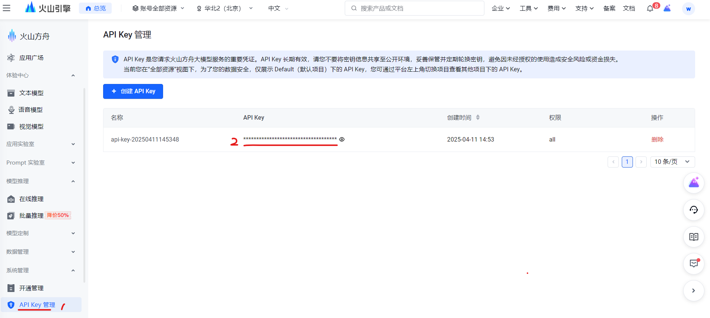
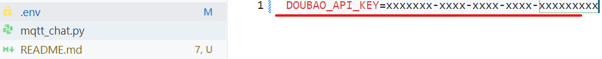
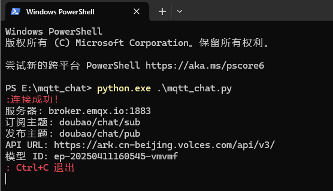
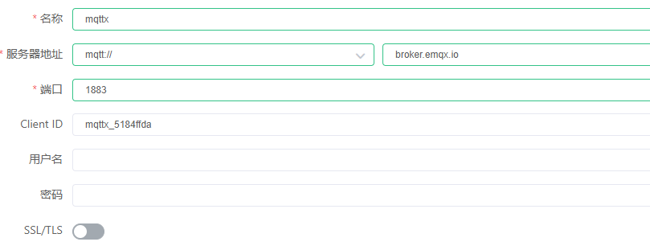
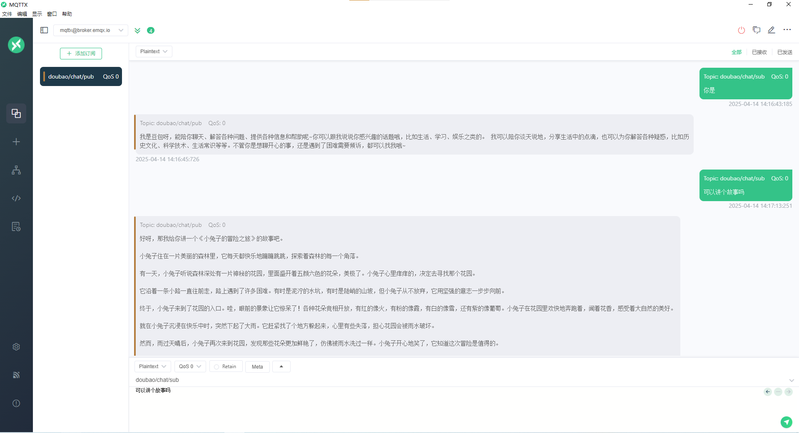
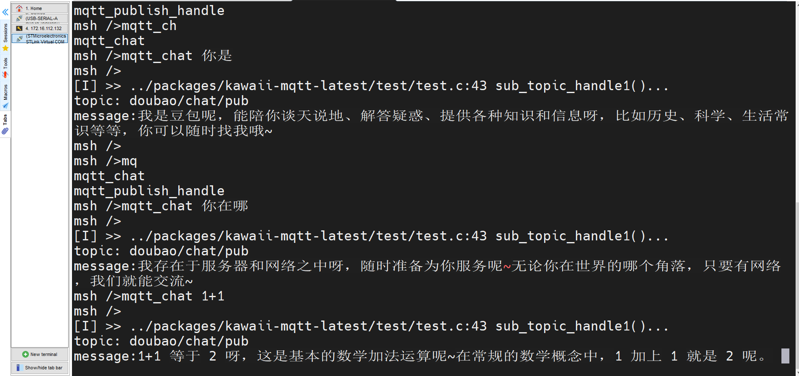

# mqtt_chat

## 简介：

AI平台并未给出MQTT相关连接方式，对于MCU端需要配置一堆软件包才能实现MCU这类平台的基本的大模型功能，除此之外，很多开发者不擅长网络，但MQTT用的较多，那是否可以使用MQTT的方式进行AI交互呢？当然可以啦。基本的实现理念是使用脚本将交互的信息通过MQTT服务进行一个转发，那么任何MQTT客户端就都可以链接该MQTT服务器进行AI交互啦，当然对话响应速度也是在可接受范围之内。如果感兴趣可以试一下啦，使用手中的星火一号，创建一个MQTT示例就可以体验啦。

## 使用步骤

### 1. 获取API Key

进入火山引擎API Key网页，获取API Key，链接如下：

```cobol
https://console.volcengine.com/ark/region:ark+cn-beijing/apiKey
```

进入上述网站，找到下述位置的API Key，记住该Key的位置，下文需要使用.



### 2.安装依赖

在windows环境下，打开命令行或者`powershell`，执行下述命令安装脚本运行需要的软件。

```powershell
pip install paho-mqtt openai python-dotenv
```

如果提示权限问题：

```powershell
pip install paho-mqtt openai python-dotenv --user
```

或以管理员身份运行：

- 按 Win，搜索 “PowerShell”，右键选择“以管理员身份运行”。

验证：

```powershell
python -c "import paho, openai, dotenv"
```

如果不报错则说明上述依赖安装成功。

最后直接将第一步获取的API Key填到工具目录下的.env文件中：



### 3.运行脚本

在power shell下运行当前脚本,示例如下：



脚本运行输出的信息有MQTT客户端需要订阅发布的主题。至此，你就可以使用任意MQTT客户端基于订阅发布实现大模型对话了。

## 使用测试

### 1.使用MQTTX软件测试：

MQTTX配置信息如下：



使用MQTTX进行AI交互如下：



2.使用`任意开发板`的MQTT客户端程序，向脚本给出的客户端订阅主题订阅就可收到AI返回的消息，向脚本给出的发布主题发布消息就可以提交至AI进行处理。下文以RT-Thread官方开发板`星火一号`(STM32F407)测试，使用kawaii-mqtt组件，测试代码放在项目根目录example文件夹。

